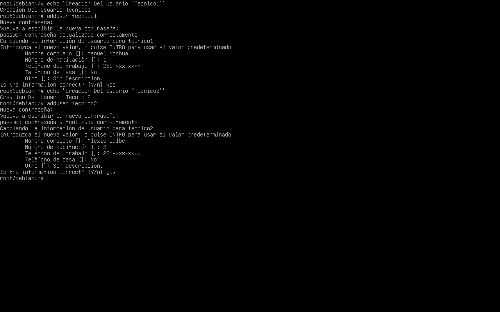
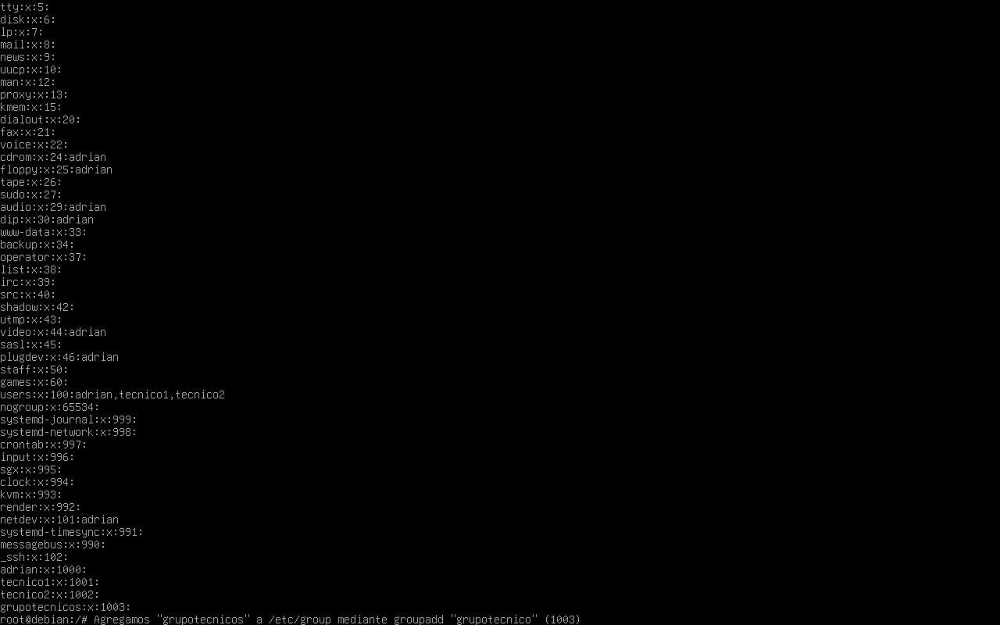
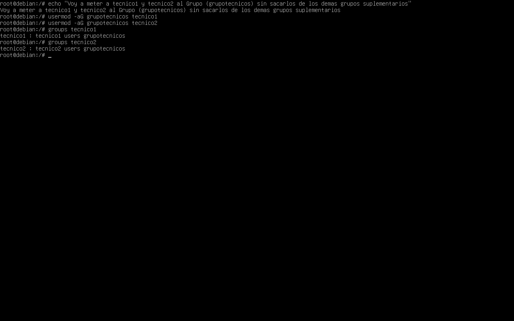
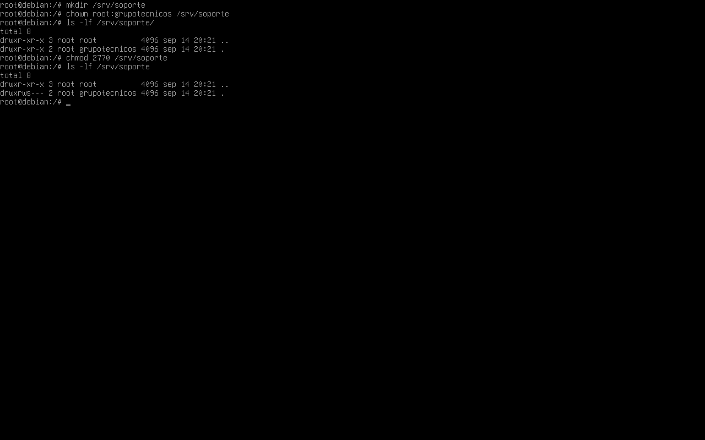
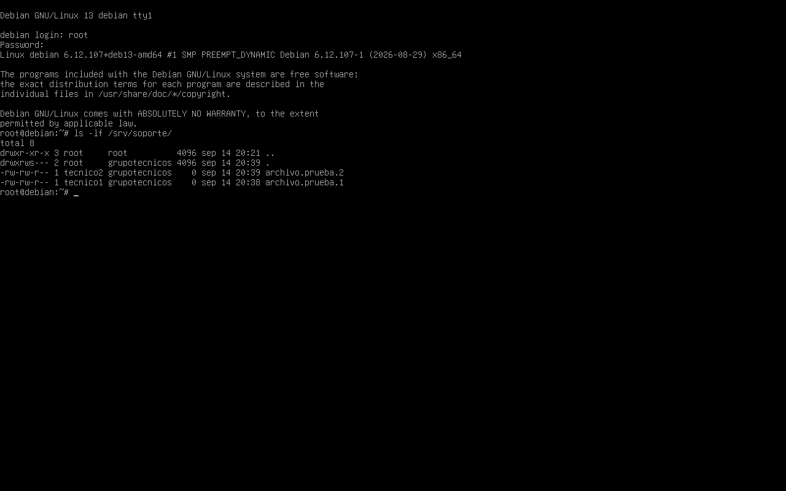
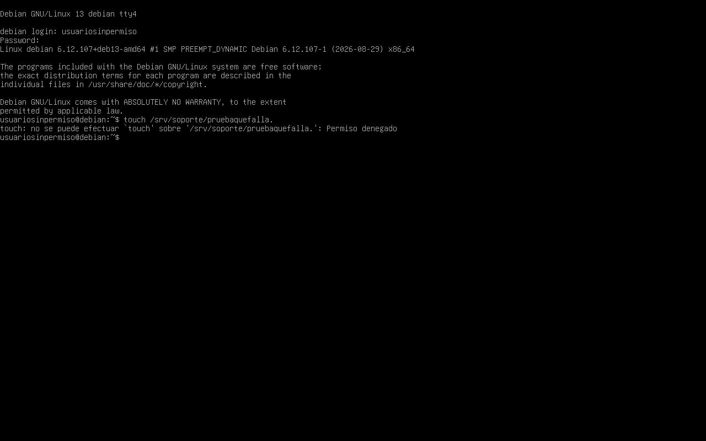
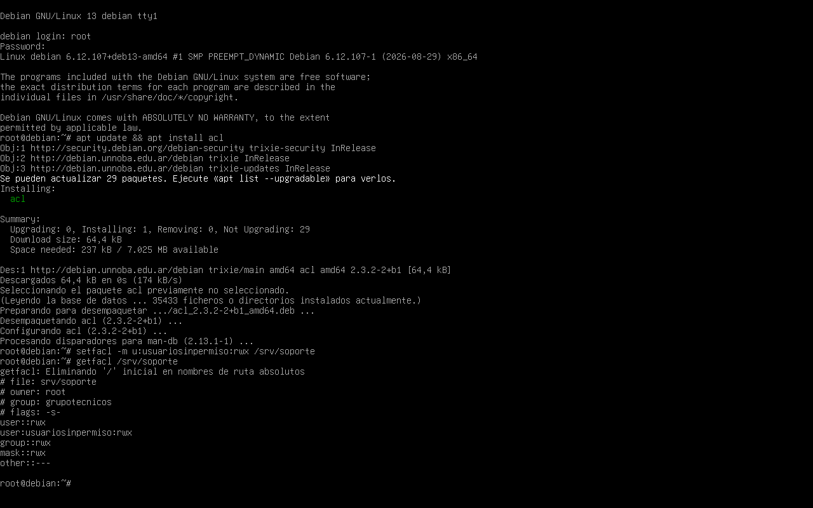
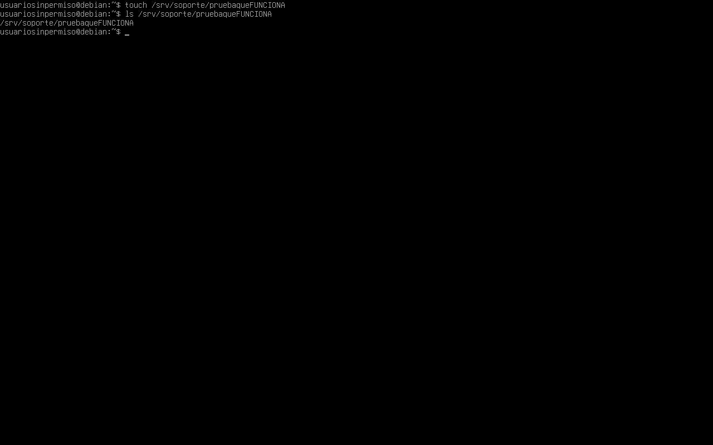
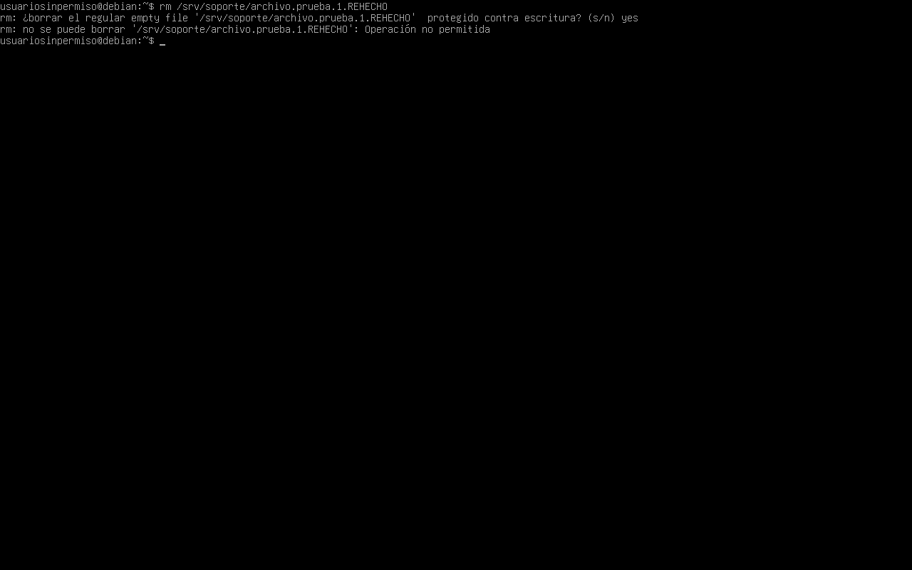

# Lab 02 — Users, Groups & Permissions

[← Índice de laboratorios](../README.md) · [Perfil de Adrián Galván](https://github.com/adrian-galvan)

Administración de usuarios y grupos, ownership, permisos clásicos, SGID, ACL y Sticky Bit sobre un directorio compartido, con verificación de herencia de grupo y resolución de `Permission denied`.

El laboratorio busca comprobar de forma práctica cómo distintos mecanismos de permisos pueden combinarse para:

- administrar usuarios y grupos;
- controlar el acceso a un directorio compartido;
- mantener la herencia de grupo mediante SGID;
- otorgar permisos específicos mediante ACL;
- diagnosticar un caso de `Permission denied`;
- restringir el borrado de archivos ajenos mediante Sticky Bit.

---

## Entorno

- Sistema operativo: Debian GNU/Linux 13
- Virtualización: Oracle VirtualBox
- Interfaz de trabajo: TTY / shell
- Usuario administrativo: `root`

---

## Escenario

Se creó un entorno de prueba con los siguientes usuarios:

- `tecnico1`
- `tecnico2`
- `usuariosinpermiso`

También se creó el grupo:

```text
grupotecnicos
```

El recurso compartido utilizado durante el laboratorio fue:

```text
/srv/soporte
```

La intención fue permitir que `tecnico1` y `tecnico2` trabajaran sobre un mismo directorio, manteniendo control sobre propiedad, grupos y permisos.

Posteriormente se utilizó `usuariosinpermiso` para comprobar el comportamiento de ACL y Sticky Bit.

---

## 1. Creación de usuarios

Se crearon los usuarios:

```bash
adduser tecnico1
adduser tecnico2
```

Cada usuario recibió su propia cuenta y contraseña.



---

## 2. Creación del grupo

Se creó un grupo destinado a los usuarios técnicos:

```bash
groupadd grupotecnicos
```

La creación del grupo fue verificada en la configuración de grupos del sistema.



---

## 3. Incorporación de usuarios al grupo

Los dos técnicos fueron agregados a `grupotecnicos` mediante:

```bash
usermod -aG grupotecnicos tecnico1
usermod -aG grupotecnicos tecnico2
```

Se utilizó `-aG` para agregar el nuevo grupo suplementario sin eliminar las demás membresías existentes de cada usuario.

La configuración fue verificada con:

```bash
groups tecnico1
groups tecnico2
```

El resultado confirmó que ambos usuarios pertenecían a `grupotecnicos`.

Si el usuario ya tenía una sesión abierta antes del cambio, debe iniciar una nueva sesión para que sus procesos incorporen el nuevo grupo suplementario.



---

## 4. Creación del directorio compartido

Se creó un directorio compartido dentro de `/srv`:

```bash
mkdir /srv/soporte
```

Luego se configuró:

- propietario: `root`
- grupo propietario: `grupotecnicos`

mediante:

```bash
chown root:grupotecnicos /srv/soporte
```

De esta forma, el directorio permanece administrado por `root`, mientras que los usuarios pertenecientes a `grupotecnicos` pueden recibir permisos sobre él.

---

## 5. Configuración de permisos y SGID

Se aplicaron los siguientes permisos:

```bash
chmod 2770 /srv/soporte
```

El modo `2770` representa:

```text
2  → SGID
7  → propietario: rwx
7  → grupo:       rwx
0  → otros:       ---
```

SGID sobre un directorio permite que los nuevos archivos y subdirectorios creados dentro de él hereden el grupo propietario del directorio padre.

Esta herencia corresponde al **grupo propietario**. Los permisos de los nuevos archivos dependen además del modo solicitado al crearlos, la `umask` y, si existe, una ACL predeterminada.

En este caso:

```text
grupotecnicos
```

La captura utiliza `ls -lf /srv/soporte` y muestra los permisos de la entrada `.`. Una comprobación directa del directorio es:

```bash
ls -ld /srv/soporte
```

La presencia de `s` en los permisos correspondientes al grupo indica que SGID está activo.



---

## 6. Verificación de SGID

Se realizaron pruebas con ambos técnicos.

Como `tecnico1` se creó:

```bash
touch /srv/soporte/archivo.prueba.1
```

Como `tecnico2` se creó:

```bash
touch /srv/soporte/archivo.prueba.2
```

Posteriormente se verificó el contenido del directorio:

```bash
ls -l /srv/soporte
```

Los archivos conservaron como propietario al usuario que los había creado:

```text
tecnico1
tecnico2
```

pero ambos heredaron como grupo:

```text
grupotecnicos
```

Esto confirmó el funcionamiento esperado de SGID.



---

## 7. Prueba con un usuario externo al grupo

Se creó un tercer usuario:

```text
usuariosinpermiso
```

Este usuario no fue agregado a `grupotecnicos`.

Al intentar crear un archivo dentro del directorio compartido:

```bash
touch /srv/soporte/pruebaquefalla
```

el sistema respondió:

```text
Permiso denegado
```

Esto confirmó que los permisos clásicos configurados sobre `/srv/soporte` impedían el acceso de escritura a usuarios externos al grupo.



---

## 8. Instalación y configuración de ACL

Para administrar ACL se instaló el paquete correspondiente:

```bash
apt update
apt install acl
```

Este paquete proporciona herramientas como:

```text
setfacl
getfacl
```

Luego se agregó una entrada ACL específica para `usuariosinpermiso`:

```bash
setfacl -m u:usuariosinpermiso:rwx /srv/soporte
```

La expresión:

```text
u:usuariosinpermiso:rwx
```

indica:

```text
u                  → usuario
usuariosinpermiso  → usuario afectado
rwx                → lectura, escritura y acceso
```

La configuración fue verificada mediante:

```bash
getfacl /srv/soporte
```

La ACL mostró una configuración similar a:

```text
user::rwx
user:usuariosinpermiso:rwx
group::rwx
mask::rwx
other::---
```

De esta manera se otorgaron permisos específicos a `usuariosinpermiso` sin necesidad de agregarlo a `grupotecnicos`.

La entrada:

```text
mask::rwx
```

representa el máximo permiso efectivo disponible para usuarios nombrados mediante ACL y grupos.

La máscara no limita al propietario del archivo ni a la entrada `other`. Cuando existe una máscara ACL, los bits de grupo mostrados por `ls -l` representan esa máscara. [Referencia: acl(5)](https://manpages.debian.org/trixie/acl/acl.5.en.html).

En esta práctica se configuró una **ACL de acceso sobre el directorio**. No se configuró una ACL predeterminada (`default`), por lo que la entrada de `usuariosinpermiso` no se hereda automáticamente en los archivos nuevos. La herencia de grupo comprobada en el paso 6 corresponde a SGID.



---

## 9. Verificación de acceso mediante ACL

Después de aplicar la ACL, `usuariosinpermiso` repitió la prueba:

```bash
touch /srv/soporte/pruebaqueFUNCIONA
```

Esta vez el archivo fue creado correctamente.

Se verificó su existencia mediante:

```bash
ls /srv/soporte
```

El cambio permitió comprobar claramente:

```text
Antes de ACL   → Permiso denegado
Después de ACL → Acceso permitido
```

ACL permitió otorgar una excepción específica al usuario sin modificar su pertenencia a grupos.



---

## 10. Prueba de borrado antes de Sticky Bit

Una vez que `usuariosinpermiso` recibió permisos `rwx` mediante ACL, se realizó una prueba adicional.

El usuario intentó eliminar un archivo creado por `tecnico1`.

Antes de activar Sticky Bit, el usuario pudo eliminar el archivo.

Esto ocurre porque la eliminación de un archivo depende principalmente de los permisos de escritura y acceso sobre el directorio que contiene esa entrada.


---

## 11. Activación de Sticky Bit

El archivo fue creado nuevamente por `tecnico1`.

Posteriormente se activó Sticky Bit sobre `/srv/soporte`, manteniendo también SGID:

```bash
chmod 3770 /srv/soporte
```

El primer dígito:

```text
3
```

representa la combinación de:

```text
2 → SGID
1 → Sticky Bit
```

Por lo tanto:

```text
3 = SGID + Sticky Bit
```

Los permisos clásicos permanecieron:

```text
770
```

es decir:

```text
propietario → rwx
grupo       → rwx
otros       → ---
```

Como el directorio ya tiene una ACL extendida, el `7` de la clase de grupo corresponde a `mask::rwx`. En este caso, la entrada `group::rwx` también conserva esos permisos.

---

## 12. Verificación de Sticky Bit

Después de activar Sticky Bit, `usuariosinpermiso` intentó nuevamente eliminar un archivo perteneciente a `tecnico1`.

El comando utilizado fue:

```bash
rm /srv/soporte/archivo.prueba.1.REHECHO
```

El sistema respondió:

```text
Operación no permitida
```

Esto confirmó que Sticky Bit impedía el borrado en el caso probado: `usuariosinpermiso` no era propietario del archivo ni del directorio y no tenía privilegios administrativos.

Sticky Bit restringe el borrado y el cambio de nombre de las entradas del directorio. El propietario del archivo, el propietario del directorio y un proceso con los privilegios correspondientes pueden superar esa restricción, sujetos a los demás controles de acceso. La modificación del contenido depende de los permisos del propio archivo. [Referencia: chmod(1)](https://manpages.debian.org/trixie/coreutils/chmod.1.en.html).



---

## Resultado final

El directorio:

```text
/srv/soporte
```

quedó configurado utilizando distintos mecanismos de control de acceso.

El laboratorio permitió comprobar:

- creación y administración de usuarios;
- creación y administración de grupos;
- grupos suplementarios;
- propiedad mediante `chown`;
- permisos clásicos mediante `chmod`;
- SGID para herencia de grupo;
- diagnóstico de `Permission denied`;
- acceso específico mediante ACL;
- máscara efectiva de ACL;
- Sticky Bit para proteger archivos pertenecientes a otros usuarios;
- verificación del resultado después de cada cambio.

---

## Flujo del laboratorio

```text
Creación de usuarios
        ↓
Creación de grupotecnicos
        ↓
Incorporación de tecnico1 y tecnico2
        ↓
Creación de /srv/soporte
        ↓
root:grupotecnicos
        ↓
SGID
        ↓
Herencia de grupo verificada
        ↓
Usuario externo al grupo
        ↓
Permission denied
        ↓
ACL específica
        ↓
Acceso permitido
        ↓
Borrado de archivo ajeno
        ↓
Sticky Bit
        ↓
Operación no permitida
```

---

## Comandos utilizados

```bash
adduser
groupadd
usermod
groups
mkdir
chown
chmod
touch
ls
rm
apt
setfacl
getfacl
```

---

## Conclusión

El laboratorio permitió observar cómo distintos mecanismos de permisos de GNU/Linux pueden combinarse para administrar un directorio compartido.

Los permisos clásicos y los grupos proporcionaron el control de acceso inicial.

SGID permitió mantener una pertenencia de grupo coherente para los archivos creados por distintos usuarios.

ACL permitió otorgar acceso específico a un usuario externo sin modificar su pertenencia al grupo.

Finalmente, Sticky Bit agregó una restricción de borrado y renombrado para los usuarios que no son propietarios del archivo ni del directorio y carecen de privilegios administrativos.

El resultado fue un entorno donde varios usuarios pueden trabajar sobre un recurso común manteniendo controles específicos sobre acceso, propiedad y eliminación de archivos.
