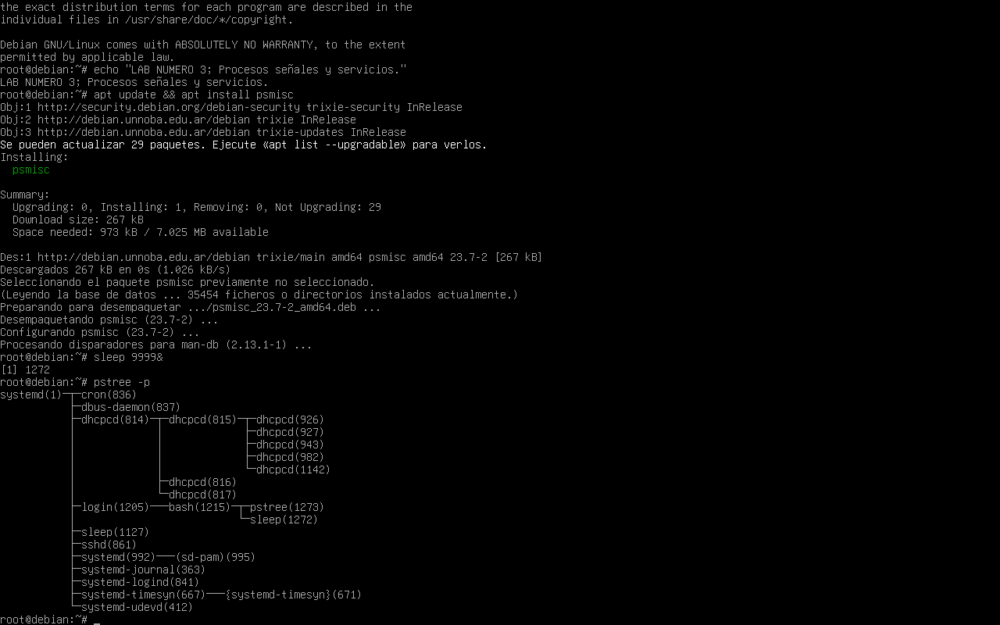
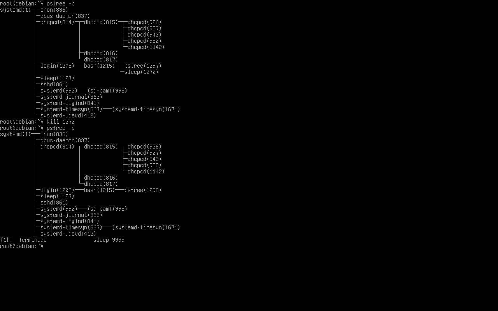
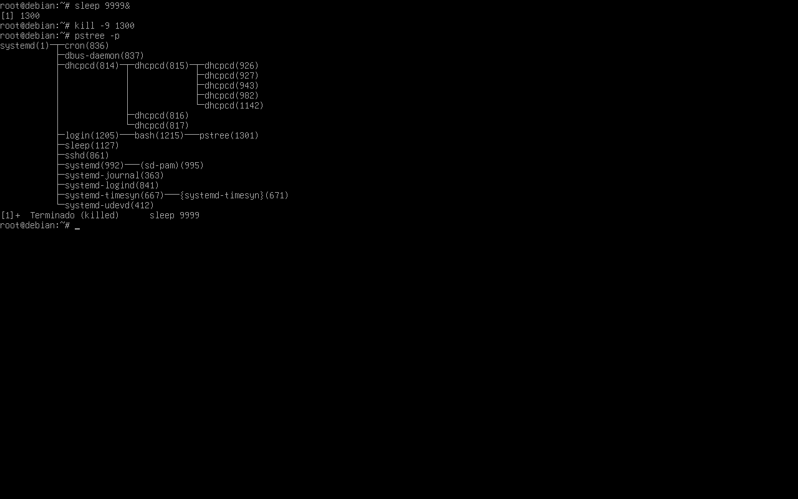
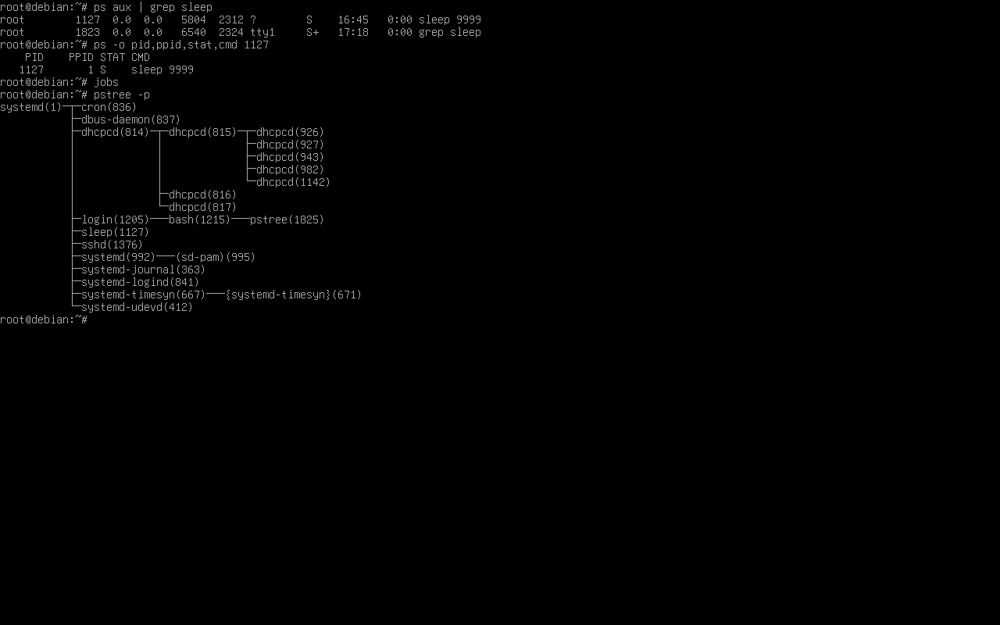
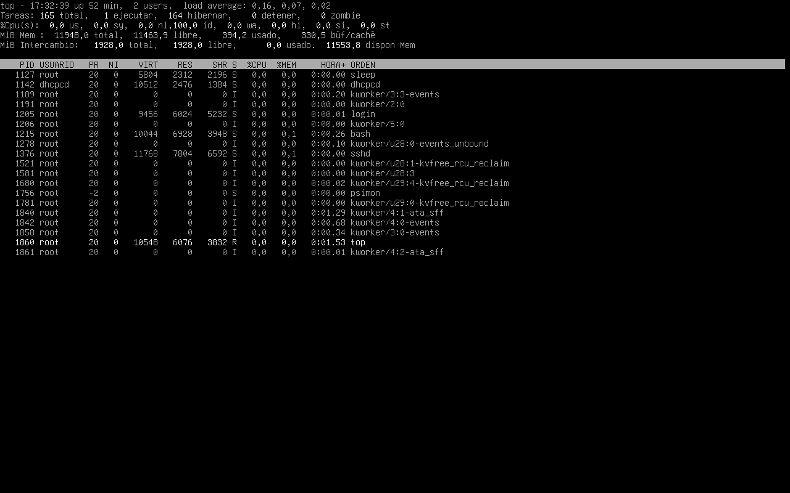
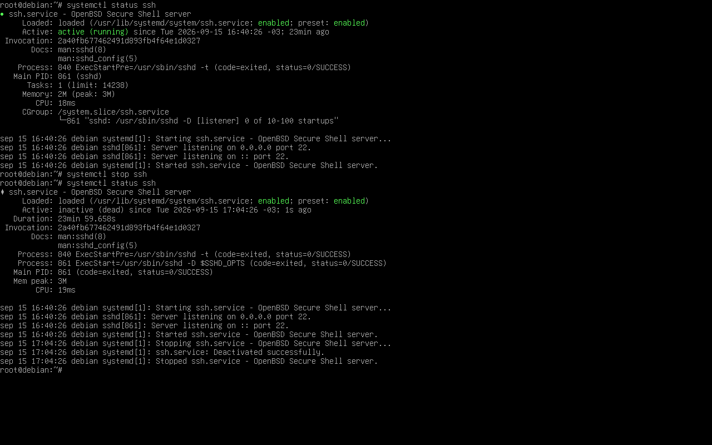
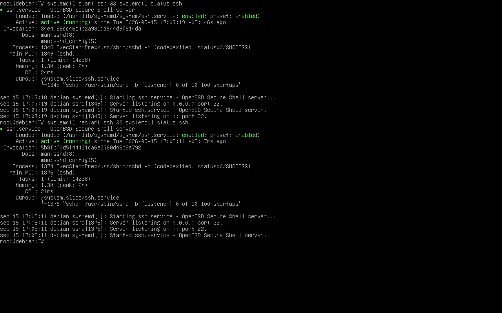
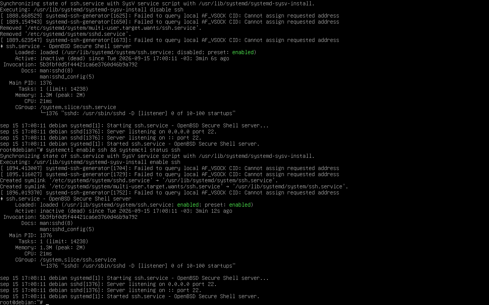

# Lab 03 — Processes, Signals & Services

## Objetivo

Administrar y observar procesos y servicios en Debian GNU/Linux mediante herramientas de línea de comandos.

El laboratorio busca comprobar de forma práctica:

- ejecución de procesos en segundo plano;
- diferencia entre Job ID y PID;
- relaciones padre/hijo entre procesos;
- identificación de PID, PPID y estado de un proceso;
- uso de señales para finalizar procesos;
- diferencia entre SIGTERM y SIGKILL;
- monitoreo dinámico mediante `top`;
- administración de servicios mediante `systemctl`;
- diferencia entre `start/stop` y `enable/disable`;
- comportamiento de un servicio después de un reinicio.

---

## Entorno

- Sistema operativo: Debian GNU/Linux 13
- Virtualización: Oracle VirtualBox
- Interfaz de trabajo: TTY / shell
- Init / gestor de servicios: systemd
- Usuario administrativo: `root`
- Servicio utilizado: OpenSSH Server (`ssh.service`)

---

## Escenario

Para estudiar procesos de forma controlada se utilizó el comando:

```bash
sleep 9999
```

Este proceso permitió observar su ejecución, PID, relación con la shell y comportamiento frente a distintas señales sin afectar otros componentes importantes del sistema.

Para la parte de administración de servicios se utilizó:

```text
ssh.service
```

permitiendo comparar el control directo de un proceso mediante señales con la administración de un servicio mediante systemd.

---

## 1. Instalación de herramientas y creación de un proceso

Para utilizar `pstree` se instaló el paquete `psmisc`:

```bash
apt update
apt install psmisc
```

Luego se creó un proceso `sleep` en segundo plano:

```bash
sleep 9999 &
```

El operador:

```text
&
```

permite ejecutar el comando en background y devolver inmediatamente el control de la terminal.

Bash mostró una salida similar a:

```text
[1] 1272
```

donde:

```text
[1]  → Job ID asignado por Bash
1272 → PID asignado por el sistema operativo
```

Esto permitió diferenciar el identificador utilizado por la shell para administrar sus trabajos del identificador global utilizado por el sistema para administrar procesos.

---

## 2. Visualización del árbol de procesos

Se utilizó:

```bash
pstree -p
```

para visualizar los procesos junto con sus PID.

El proceso creado apareció como hijo de la shell desde la cual había sido ejecutado:

```text
login
└── bash
    ├── pstree
    └── sleep
```

Esto permitió observar gráficamente la relación padre/hijo existente entre Bash y el proceso `sleep`.



---

## 3. Terminación mediante SIGTERM

El primer proceso fue finalizado utilizando:

```bash
kill PID
```

Al no especificar una señal explícitamente, `kill` utiliza normalmente SIGTERM.

También puede expresarse como:

```bash
kill -15 PID
```

SIGTERM solicita al proceso que termine.

Después de enviar la señal se volvió a ejecutar:

```bash
pstree -p
```

y el proceso dejó de aparecer en el árbol.

Bash también informó la finalización del trabajo:

```text
Terminado    sleep 9999
```



---

## 4. Terminación forzada mediante SIGKILL

Se creó otro proceso:

```bash
sleep 9999 &
```

Posteriormente se utilizó:

```bash
kill -9 PID
```

La señal `9` corresponde a SIGKILL.

A diferencia de SIGTERM, SIGKILL fuerza la terminación del proceso y no puede ser gestionada o ignorada por el proceso receptor.

Después de ejecutar nuevamente:

```bash
pstree -p
```

el proceso había desaparecido.

Bash indicó:

```text
Terminado (killed)    sleep 9999
```

La práctica permitió comparar:

```text
SIGTERM (15) → solicita una terminación
SIGKILL (9)  → fuerza la terminación
```



---

## 5. Identificación de PID, PPID y estado

Se localizó un proceso `sleep` mediante:

```bash
ps aux | grep sleep
```

Luego se consultaron únicamente algunos campos relevantes:

```bash
ps -o pid,ppid,stat,cmd 1127
```

La salida observada fue similar a:

```text
PID   PPID   STAT   CMD
1127     1      S   sleep 9999
```

Los campos utilizados representan:

```text
PID  → identificador del proceso
PPID → identificador de su proceso padre
STAT → estado actual
CMD  → comando ejecutado
```

El estado:

```text
S
```

indicó que el proceso se encontraba en estado **Sleeping**.

Además, el PPID era:

```text
1
```

y `pstree -p` mostraba al proceso bajo:

```text
systemd(1)
```

Por lo tanto, en esta práctica el proceso aparecía reparentado al proceso PID 1.

---

## 6. Diferencia entre procesos y jobs

Después de localizar el proceso mediante `ps`, se ejecutó:

```bash
jobs
```

El proceso no apareció en la salida.

Esto permitió comprobar una diferencia importante:

```text
ps
→ permite observar procesos del sistema

jobs
→ muestra únicamente los trabajos administrados por la shell actual
```

Un proceso puede continuar existiendo en el sistema aunque no forme parte de la tabla de jobs de la shell desde la que se está trabajando.

Finalmente se utilizó nuevamente:

```bash
pstree -p
```

para relacionar visualmente la información de PID y PPID obtenida mediante `ps`.



---

## 7. Monitoreo de procesos mediante top

Se utilizó:

```bash
top
```

para observar dinámicamente los procesos del sistema.

Entre la información disponible se pudieron visualizar:

```text
PID
usuario
prioridad
estado
uso de CPU
uso de memoria
tiempo de CPU
comando
```

El proceso `sleep` apareció con:

```text
estado: S
CPU: 0.0 %
comando: sleep
```

El bajo uso de CPU es coherente con el comportamiento del comando `sleep`, ya que permanece esperando durante el tiempo especificado.

`top` permitió observar en tiempo real el estado general del sistema y sus procesos.



---

# Administración de servicios con systemd

Hasta este punto se trabajó directamente con procesos.

La segunda parte del laboratorio utiliza un servicio administrado por systemd para observar la diferencia entre:

```text
controlar un proceso directamente
```

y:

```text
administrar un servicio mediante systemd
```

El servicio elegido fue OpenSSH Server:

```text
ssh.service
```

---

## 8. Verificación y detención de ssh.service

Primero se verificó el estado del servicio:

```bash
systemctl status ssh
```

El resultado indicaba:

```text
Active: active (running)
```

Posteriormente se detuvo mediante:

```bash
systemctl stop ssh
```

y se volvió a consultar:

```bash
systemctl status ssh
```

El estado pasó a:

```text
Active: inactive (dead)
```

Los mensajes de systemd también mostraron una detención correcta:

```text
Stopping ssh.service...
ssh.service: Deactivated successfully.
Stopped ssh.service.
```

Esto demuestra que `systemctl stop` solicita a systemd detener correctamente la unidad, en lugar de actuar directamente sobre un PID de forma aislada.



---

## 9. Inicio y reinicio del servicio

El servicio fue iniciado nuevamente:

```bash
systemctl start ssh
systemctl status ssh
```

Volvió al estado:

```text
Active: active (running)
```

Posteriormente se utilizó:

```bash
systemctl restart ssh
systemctl status ssh
```

El servicio continuó apareciendo como:

```text
Active: active (running)
```

pero se observó un cambio en el proceso principal.

Antes del reinicio:

```text
Main PID: 1349
```

Después del reinicio:

```text
Main PID: 1376
```

El cambio de PID permitió comprobar que `restart` reinició el proceso principal de `sshd` y systemd inició una nueva instancia del servicio.



---

## 10. enable y disable

También se probó la configuración de inicio automático del servicio.

Se utilizó:

```bash
systemctl disable ssh
```

y posteriormente:

```bash
systemctl enable ssh
```

Al habilitar nuevamente la unidad, systemd creó los enlaces simbólicos necesarios para asociar el servicio con el target correspondiente.

Esta prueba permitió diferenciar dos conceptos:

```text
start / stop
→ modifican el estado actual del servicio

enable / disable
→ modifican su configuración de inicio automático
```

Un servicio puede estar:

```text
enabled
```

pero al mismo tiempo:

```text
inactive (dead)
```

porque `enable` no implica iniciar inmediatamente el servicio.

Del mismo modo, `disable` no equivale por sí solo a detener un servicio que ya se encuentra ejecutándose.



---

## Diferencia entre procesos y servicios

Durante el laboratorio se observaron dos niveles distintos de administración.

### Proceso individual

Ejemplo:

```bash
sleep 9999 &
```

Puede ser localizado y controlado mediante herramientas como:

```bash
ps
pstree
top
kill
```

Las señales son enviadas directamente al proceso identificado mediante su PID.

### Servicio

Ejemplo:

```text
ssh.service
```

Es administrado por systemd.

La herramienta utilizada para comunicarse con systemd fue:

```bash
systemctl
```

Por ejemplo:

```bash
systemctl status ssh
systemctl stop ssh
systemctl start ssh
systemctl restart ssh
systemctl enable ssh
systemctl disable ssh
```

`systemctl` no reemplaza a `kill`.

Ambas herramientas trabajan en niveles distintos:

```text
kill
↓
proceso / PID

systemctl
↓
systemd
↓
unidad / servicio
↓
proceso o procesos asociados
```

---

## Flujo del laboratorio

```text
Creación de proceso con sleep
        ↓
Background mediante &
        ↓
Job ID y PID
        ↓
pstree
        ↓
Relación padre/hijo
        ↓
SIGTERM
        ↓
SIGKILL
        ↓
ps
        ↓
PID / PPID / STAT
        ↓
jobs
        ↓
top
        ↓
ssh.service
        ↓
systemctl status
        ↓
stop / start / restart
        ↓
cambio de Main PID
        ↓
enable / disable
```

---

## Comandos utilizados

```bash
apt
sleep
jobs
ps
grep
pstree
kill
top
systemctl
```

---

## Resultado final

El laboratorio permitió administrar procesos y servicios desde dos niveles diferentes.

Con los procesos se comprobó:

```text
creación
identificación
relación padre/hijo
PID y PPID
estado
ejecución en background
envío de señales
terminación
monitoreo dinámico
```

Con los servicios se comprobó:

```text
consulta de estado
detención
inicio
reinicio
cambio del proceso principal
habilitación de inicio automático
deshabilitación de inicio automático
```

---

## Conclusión

El laboratorio permitió comprender la diferencia entre observar y controlar procesos individuales y administrar servicios gestionados por systemd.

`ps`, `pstree` y `top` permitieron inspeccionar los procesos desde distintas perspectivas.

Las señales SIGTERM y SIGKILL permitieron comprobar diferentes formas de terminación.

Finalmente, `systemctl` permitió administrar el ciclo de vida de `ssh.service` y diferenciar el estado actual del servicio de su configuración de inicio automático.

La práctica también permitió relacionar Job ID, PID, PPID, estados de procesos y el rol de systemd como PID 1 dentro del sistema.
