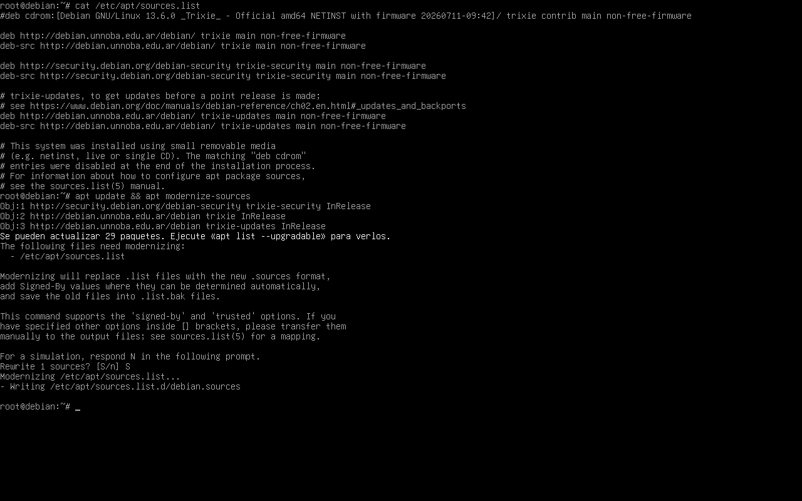
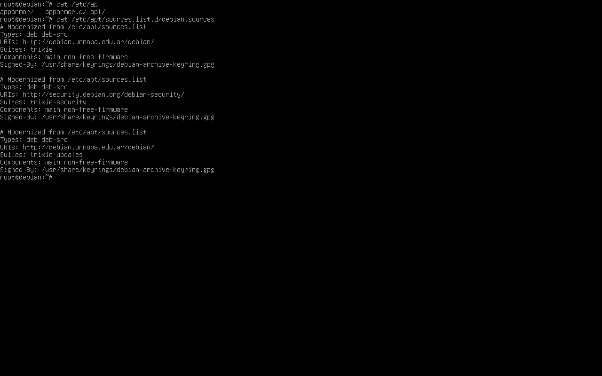
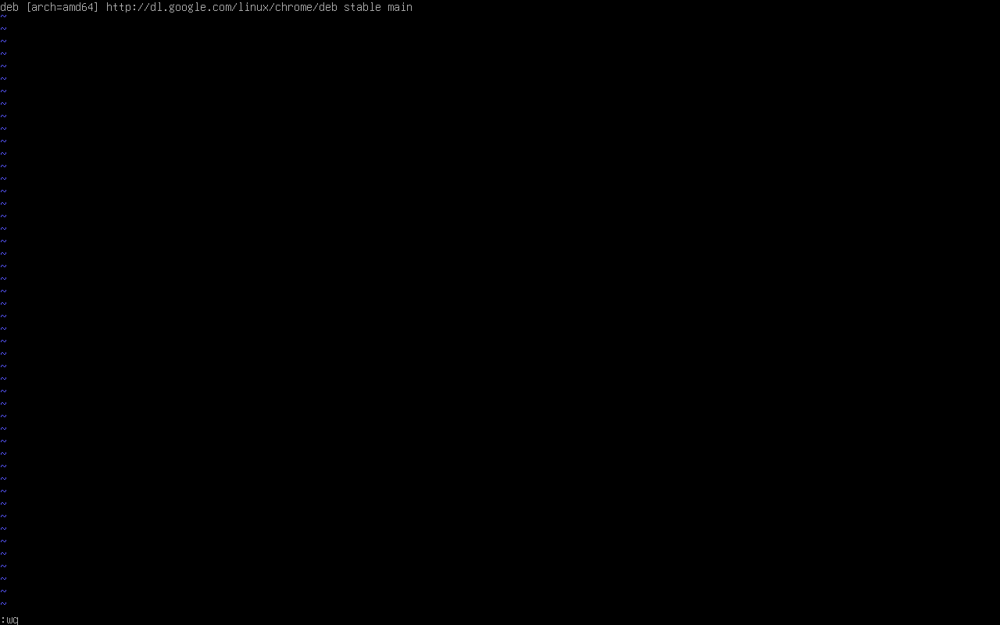
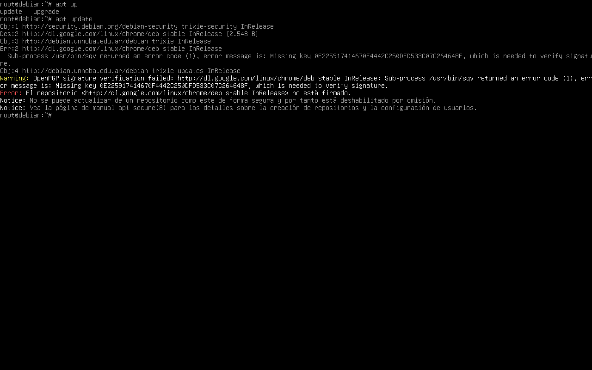
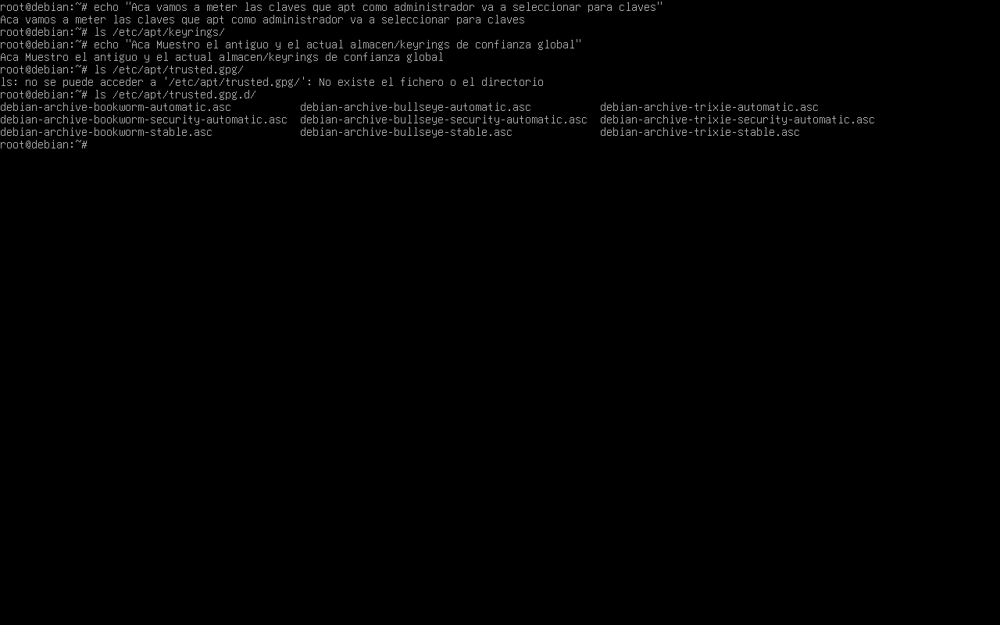
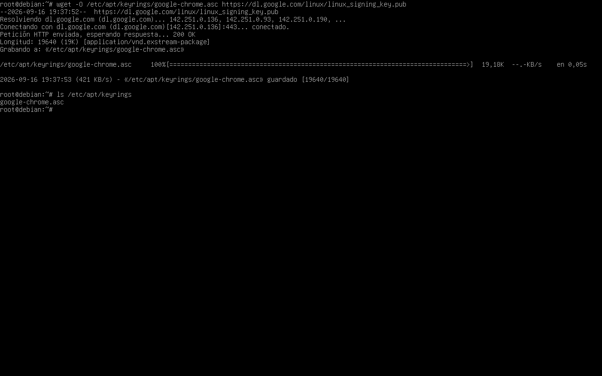
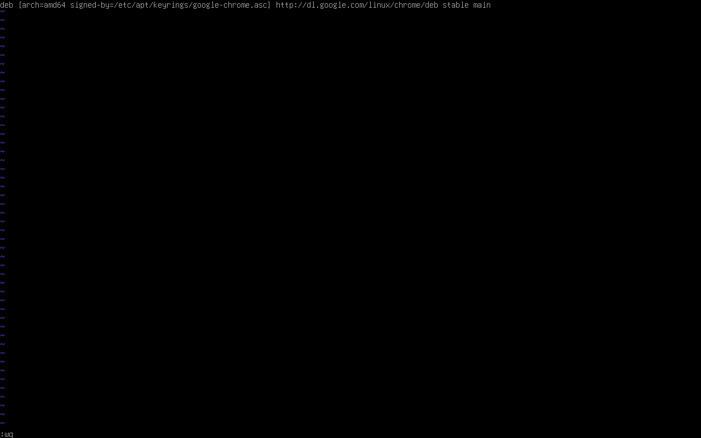
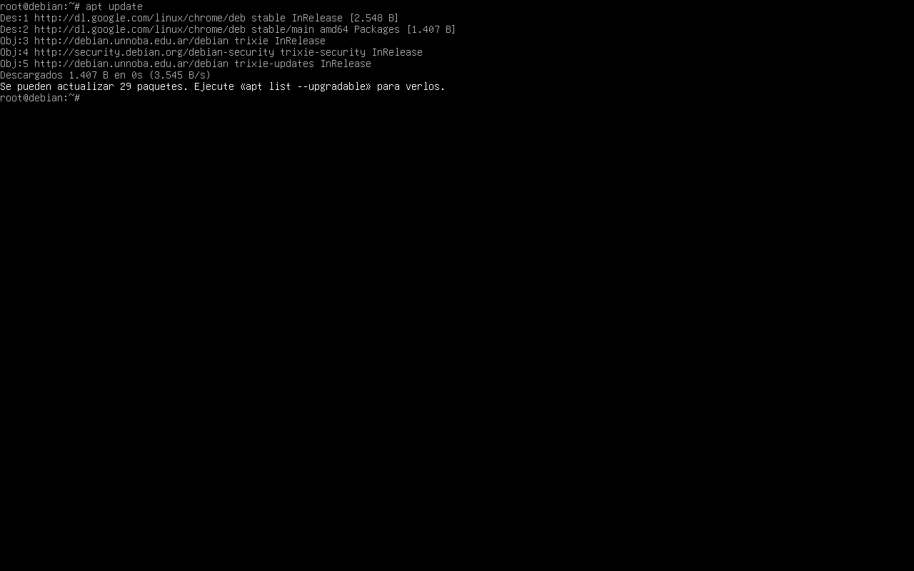
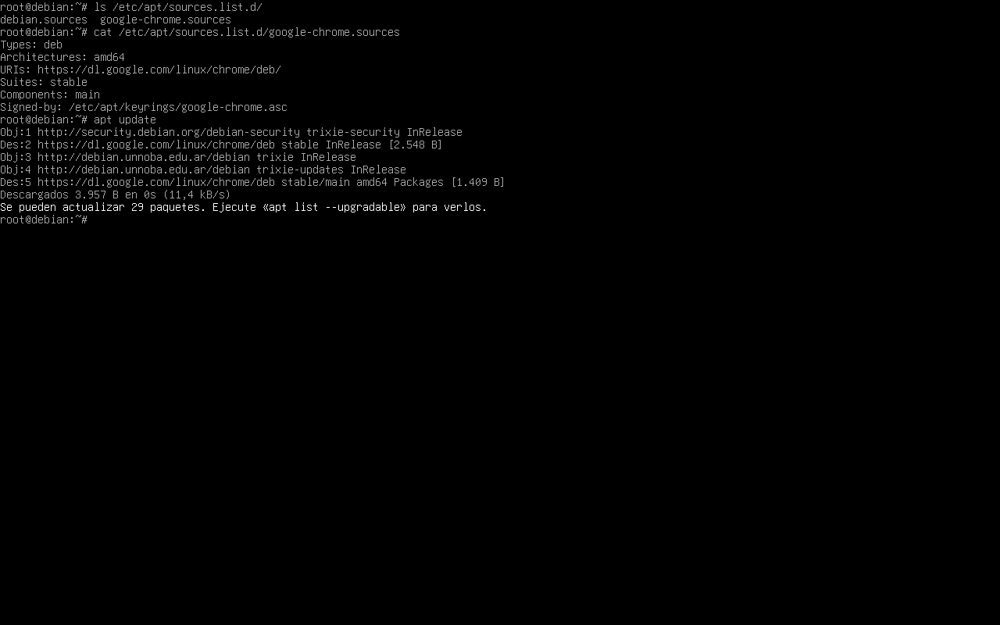

# Lab 04 — APT, Repositories & Package Trust

[← Índice de laboratorios](../README.md) · [Perfil de Adrián Galván](https://github.com/adrian-galvan)

## Objetivo

Comprender y documentar el funcionamiento de los repositorios APT en Debian 13, trabajando con:

- formato clásico `.list`
- formato moderno Deb822 `.sources`
- repositorios externos
- metadatos firmados
- claves públicas OpenPGP
- almacenes de confianza de APT
- `/etc/apt/keyrings/`
- `Signed-By`
- migración de una fuente clásica a Deb822

El laboratorio parte de la configuración real del sistema, provoca intencionalmente un fallo de verificación al agregar un repositorio externo sin una clave pública asociada y posteriormente corrige la configuración mediante una clave específica y `Signed-By`.

Finalmente, el repositorio externo también es migrado desde el formato clásico `.list` al formato Deb822 `.sources`.

El repositorio de Google Chrome se utiliza para estudiar la configuración y la confianza de APT. El laboratorio termina con la actualización de índices; no requiere instalar Chrome ni disponer de un entorno gráfico.

---

## Entorno

- Debian GNU/Linux 13 "Trixie"
- Arquitectura `amd64`
- Oracle VirtualBox
- Instalación mínima sin entorno gráfico
- Trabajo mediante TTY y shell
- Usuario `root`
- APT
- `vim`
- `wget`

---

## 1. Configuración inicial de APT

La instalación utilizaba inicialmente el formato clásico de configuración de repositorios mediante:

```text
/etc/apt/sources.list
```

Se inspeccionó su contenido con:

```bash
cat /etc/apt/sources.list
```

El formato clásico representa cada fuente en una sola línea.

Ejemplo:

```text
deb http://debian.unnoba.edu.ar/debian/ trixie main non-free-firmware
```

Posteriormente se actualizaron los índices y se ejecutó la herramienta de modernización de APT:

```bash
apt update && apt modernize-sources
```

APT detectó el archivo clásico y lo convirtió al formato moderno Deb822.

El archivo anterior quedó preservado como respaldo `.bak`.



---

## 2. Repositorios oficiales en formato Deb822

Luego de la modernización, la configuración oficial de Debian quedó almacenada en:

```text
/etc/apt/sources.list.d/debian.sources
```

Se inspeccionó mediante:

```bash
cat /etc/apt/sources.list.d/debian.sources
```

El formato Deb822 utiliza campos estructurados del tipo:

```text
Nombre: valor
```

Por ejemplo:

```text
Types: deb deb-src
URIs: http://debian.unnoba.edu.ar/debian/
Suites: trixie
Components: main non-free-firmware
Signed-By: /usr/share/keyrings/debian-archive-keyring.gpg
```

La información que en el formato clásico se encontraba concentrada en una línea ahora aparece separada en campos explícitos.



APT puede utilizar archivos `.list` y `.sources` simultáneamente.

Por ese motivo, para el siguiente paso se agregó temporalmente un repositorio externo utilizando nuevamente el formato clásico.

---

## 3. Crear un repositorio externo en formato clásico

Se creó un archivo independiente para Google Chrome:

```bash
touch /etc/apt/sources.list.d/google-chrome.list
```

Luego se abrió con:

```bash
vim /etc/apt/sources.list.d/google-chrome.list
```

Inicialmente se agregó la siguiente definición:

```text
deb [arch=amd64] http://dl.google.com/linux/chrome/deb stable main
```

La línea puede interpretarse de la siguiente manera:

```text
deb
→ repositorio de paquetes binarios

arch=amd64
→ utilizar esta fuente para arquitectura amd64

http://dl.google.com/linux/chrome/deb
→ ubicación del repositorio

stable
→ suite definida por Google

main
→ componente del repositorio
```



El archivo no contiene físicamente el repositorio.

Contiene la definición necesaria para que APT sepa:

```text
dónde se encuentra
+
cómo debe consultarlo
```

---

## 4. Formato clásico y formato Deb822

Una misma fuente puede representarse utilizando el formato clásico `.list` o el formato moderno Deb822 `.sources`.

Formato clásico con `Signed-By`:

```text
deb [arch=amd64 signed-by=/etc/apt/keyrings/google-chrome.asc] https://dl.google.com/linux/chrome/deb/ stable main
```

Formato Deb822 equivalente:

```text
Types: deb
Architectures: amd64
URIs: https://dl.google.com/linux/chrome/deb/
Suites: stable
Components: main
Signed-By: /etc/apt/keyrings/google-chrome.asc
```

La diferencia principal se encuentra en cómo se representa la configuración:

```text
.list
→ formato clásico de una línea

.sources
→ formato Deb822 basado en campos Nombre: valor
```

Esto es independiente del modelo de confianza utilizado por APT.

Un archivo `.list` también puede utilizar `Signed-By`.

Durante la prueba inicial se utilizó la URL HTTP mostrada en la captura. En la configuración final se dejó la fuente utilizando HTTPS.

---

## 5. Intento de actualización sin clave asociada

La fuente de Google fue agregada inicialmente sin `Signed-By`.

En esa configuración APT recurre a sus claves de confianza global, donde no estaba disponible la clave necesaria de Google. La ausencia de `Signed-By` por sí sola no provoca un error de firma: el fallo aparece porque ninguna clave disponible permite verificar esos metadatos. [Referencia: sources.list(5)](https://manpages.debian.org/trixie/apt/sources.list.5.en.html).

Se ejecutó:

```bash
apt update
```

APT logró contactar el repositorio y obtener su archivo `InRelease`, pero no pudo verificar criptográficamente los metadatos.

Entre los mensajes apareció:

```text
Missing key ... which is needed to verify signature
```



Esto permitió comprobar que el repositorio era alcanzable.

El problema no estaba en localizar el servidor, sino en establecer confianza criptográfica sobre los metadatos recibidos.

El flujo observado fue:

```text
Google publica metadatos
        ↓
Google firma esos metadatos
        ↓
APT descarga metadatos + firma
        ↓
APT necesita la clave pública correspondiente
        ↓
sin esa clave no puede verificar la firma
```

### Regla mental

```text
clave privada
→ firma

clave pública
→ verifica

Signed-By
→ indica qué clave o keyring debe utilizar APT
  para verificar una fuente determinada
```

---

## 6. Inspección de los almacenes de claves

Antes de agregar la clave de Google se inspeccionó:

```bash
ls -l /etc/apt/keyrings/
```

El directorio existía pero se encontraba vacío.

`/etc/apt/keyrings/` es una ubicación destinada a claves administradas localmente que posteriormente pueden ser asociadas explícitamente a una fuente mediante `Signed-By`.

También se inspeccionó el modelo histórico de confianza global.

Primero:

```bash
ls -l /etc/apt/trusted.gpg
```

En esta instalación de Debian 13 el archivo no existía.

Luego:

```bash
ls -l /etc/apt/trusted.gpg.d/
```

Este directorio sí contenía distintos archivos de claves de Debian.



Conceptualmente:

```text
/etc/apt/trusted.gpg
→ keyring global histórico basado en un único archivo

/etc/apt/trusted.gpg.d/
→ múltiples archivos/keyrings
→ continúan formando parte del conjunto de confianza global

/etc/apt/keyrings/
+
Signed-By
→ claves administradas localmente
→ asociadas explícitamente a fuentes determinadas
```

Guardar una clave dentro de `/etc/apt/keyrings/` por sí solo no hace que APT la utilice automáticamente para una fuente.

La definición del repositorio debe referenciarla mediante `Signed-By`.

En esta configuración, el archivo de clave debe ser legible por el usuario del sistema `_apt`, y los directorios de su ruta deben permitirle el acceso. `/usr/share/keyrings/` se utiliza habitualmente para claves administradas por paquetes; `/etc/apt/keyrings/`, para claves administradas localmente.

---

## 7. Descargar la clave pública de Google

La clave pública utilizada para verificar el repositorio fue descargada mediante:

```bash
wget -O /etc/apt/keyrings/google-chrome.asc https://dl.google.com/linux/linux_signing_key.pub
```

La estructura general del comando es:

```text
wget [opción] [archivo de destino] [URL de origen]
```

En este caso:

```text
wget
→ programa utilizado para descargar el recurso

-O
→ indica el nombre y ubicación exactos
  del archivo de salida

/etc/apt/keyrings/google-chrome.asc
→ destino local

https://dl.google.com/linux/linux_signing_key.pub
→ recurso remoto
```

`wget -O` crea el archivo de destino si no existe.

No fue necesario utilizar previamente `touch`.

### Error encontrado durante la descarga

En el primer intento se escribió incorrectamente la URL:

```text
linux_signing-key.pub
```

en lugar de:

```text
linux_signing_key.pub
```

El servidor respondió:

```text
404 Not Found
```

Ese error permitió diferenciar una URL incorrecta de un problema de conectividad.

La secuencia observada fue:

```text
DNS resolvió dl.google.com
        ↓
se estableció conexión HTTPS
        ↓
Google recibió la petición
        ↓
el recurso solicitado no existía
        ↓
404 Not Found
```

Luego de corregir la URL:

```bash
wget -O /etc/apt/keyrings/google-chrome.asc https://dl.google.com/linux/linux_signing_key.pub
```

la descarga finalizó correctamente.

Se verificó mediante:

```bash
ls -l /etc/apt/keyrings/
```

apareciendo:

```text
google-chrome.asc
```



---

## 8. Asociar la clave al repositorio mediante Signed-By

En este punto la clave ya existía en:

```text
/etc/apt/keyrings/google-chrome.asc
```

pero todavía era necesario indicarle a APT qué fuente debía utilizarla.

Se volvió a editar:

```bash
vim /etc/apt/sources.list.d/google-chrome.list
```

Configuración original:

```text
deb [arch=amd64] http://dl.google.com/linux/chrome/deb stable main
```

Configuración modificada:

```text
deb [arch=amd64 signed-by=/etc/apt/keyrings/google-chrome.asc] http://dl.google.com/linux/chrome/deb stable main
```



Ahora la relación quedó explícita:

```text
/etc/apt/keyrings/google-chrome.asc
        ↓
signed-by=
        ↓
google-chrome.list
        ↓
APT utiliza esa clave para verificar
esa fuente específica
```

Esto limita el alcance de la clave respecto de incorporarla al conjunto de confianza global.

---

## 9. Verificación correcta mediante apt update

Se ejecutó nuevamente:

```bash
apt update
```

Esta vez APT pudo consultar correctamente el repositorio de Google.



El flujo fue:

```text
APT encuentra Google
        ↓
descarga InRelease
        ↓
encuentra Signed-By
        ↓
utiliza google-chrome.asc
        ↓
verifica la firma
        ↓
acepta los metadatos
        ↓
descarga el índice de paquetes
```

El error `Missing key` desapareció.

Esto todavía no instala Google Chrome.

Solamente permite que APT verifique los metadatos del repositorio e incorpore su índice de paquetes.

La cadena de verificación conecta la firma de `InRelease` (o de `Release` mediante `Release.gpg`) con los hashes de los índices y, a través de estos, con los hashes de los paquetes `.deb`. La comprobación documentada aquí llega hasta los índices; no incluye la descarga o instalación de Chrome. [Referencia: apt-secure(8)](https://manpages.debian.org/trixie/apt/apt-secure.8.en.html).

---

## 10. Migración final del repositorio de Google a Deb822

Para finalizar el laboratorio, el repositorio externo fue migrado desde el formato clásico:

```text
google-chrome.list
```

al formato moderno Deb822:

```text
google-chrome.sources
```

La fuente final quedó definida en:

```text
/etc/apt/sources.list.d/google-chrome.sources
```

utilizando la sintaxis:

```text
Types: deb
Architectures: amd64
URIs: https://dl.google.com/linux/chrome/deb/
Suites: stable
Components: main
Signed-By: /etc/apt/keyrings/google-chrome.asc
```

Durante esta etapa se comprobó también que la extensión válida para Deb822 es:

```text
.sources
```

y no:

```text
.source
```

APT ignora archivos con extensiones de fuente no reconocidas.

Una vez corregida la extensión y configurado el contenido Deb822, se verificaron las fuentes activas:

```bash
ls /etc/apt/sources.list.d/
```

El resultado final fue:

```text
debian.sources
google-chrome.sources
```

La definición anterior de `google-chrome.list` ya no figura entre las fuentes activas. Al reproducir la migración hay que retirar o deshabilitar la entrada antigua para evitar definir dos veces el mismo repositorio.

También se comprobó el contenido:

```bash
cat /etc/apt/sources.list.d/google-chrome.sources
```

y finalmente:

```bash
apt update
```

APT consultó correctamente los repositorios oficiales de Debian y el repositorio de Google sin errores de firma.

La misma captura permite comprobar:

```text
debian.sources + google-chrome.sources
        ↓
configuración Deb822 de Google
        ↓
Signed-By configurado
        ↓
apt update exitoso
```



---

## Resultado final

El laboratorio permitió diferenciar dos conceptos que pueden confundirse fácilmente.

### Formato de configuración

```text
.list
vs
.sources
```

determina cómo se describe una fuente de paquetes.

```text
.list
→ sintaxis clásica de una línea

.sources
→ sintaxis Deb822 estructurada por campos
```

### Modelo de confianza

```text
trusted.gpg / trusted.gpg.d
vs
/etc/apt/keyrings + Signed-By
```

determina cómo APT selecciona las claves utilizadas para verificar repositorios.

Por lo tanto:

```text
.list ≠ necesariamente confianza global

.sources ≠ automáticamente confianza acotada
```

Un archivo `.list` puede utilizar perfectamente:

```text
signed-by=/etc/apt/keyrings/...
```

La sintaxis de la fuente y el modelo utilizado para seleccionar la clave de verificación son conceptos relacionados, pero independientes.

---

## Flujo completo del laboratorio

```text
/etc/apt/sources.list
        ↓
apt modernize-sources
        ↓
debian.sources
        ↓
crear google-chrome.list
        ↓
agregar Google sin Signed-By
        ↓
apt update
        ↓
Missing key
        ↓
inspeccionar almacenes/keyrings
        ↓
/etc/apt/keyrings/
        ↓
descargar clave pública de Google
        ↓
google-chrome.asc
        ↓
agregar Signed-By
        ↓
apt update
        ↓
firma verificada
        ↓
índice aceptado
        ↓
migrar configuración clásica
        ↓
google-chrome.sources
        ↓
apt update final
        ↓
configuración funcional en Deb822
```

---

## Comandos principales utilizados

```bash
cat /etc/apt/sources.list

apt update

apt modernize-sources

cat /etc/apt/sources.list.d/debian.sources

touch /etc/apt/sources.list.d/google-chrome.list

vim /etc/apt/sources.list.d/google-chrome.list

apt update

ls -l /etc/apt/keyrings/

ls -l /etc/apt/trusted.gpg

ls -l /etc/apt/trusted.gpg.d/

wget -O /etc/apt/keyrings/google-chrome.asc https://dl.google.com/linux/linux_signing_key.pub

ls -l /etc/apt/keyrings/

vim /etc/apt/sources.list.d/google-chrome.list

apt update

ls /etc/apt/sources.list.d/

cat /etc/apt/sources.list.d/google-chrome.sources

apt update
```

---

## Conclusión

Este laboratorio permitió estudiar APT más allá de los comandos habituales de instalación y actualización de paquetes.

Se trabajó con fuentes de software, formatos `.list` y `.sources`, Deb822, repositorios externos, metadatos firmados, claves públicas, keyrings y `Signed-By`.

La práctica también permitió observar y diagnosticar errores reales en lugar de limitarse a ejecutar una secuencia de comandos.

El error:

```text
Missing key
```

mostró que alcanzar correctamente un repositorio no implica poder verificar criptográficamente sus metadatos.

El error:

```text
404 Not Found
```

permitió distinguir una URL incorrecta de un problema de conectividad.

También se comprobó que:

```text
.source
```

no es una extensión válida para una fuente Deb822, mientras que:

```text
.sources
```

sí lo es.

Finalmente, tanto los repositorios oficiales de Debian como el repositorio externo de Google quedaron definidos utilizando Deb822, y la fuente externa quedó asociada explícitamente a su clave mediante `Signed-By`.

---

## Estructura final

```text
/etc/apt/sources.list.d/
├── debian.sources
└── google-chrome.sources

/etc/apt/keyrings/
└── google-chrome.asc
```

La configuración final utiliza fuentes Deb822 y selecciona explícitamente la clave destinada a verificar el repositorio externo de Google.
